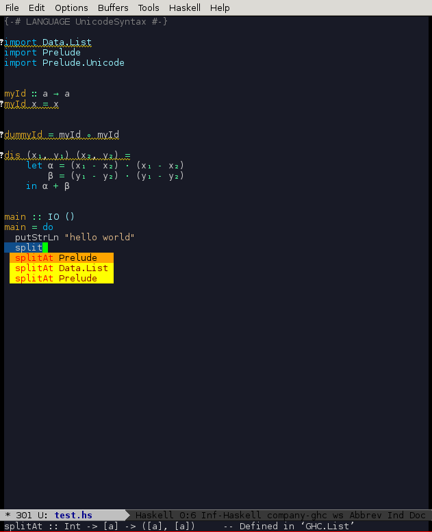

# unicode-input.el #

This is an convinient unicode characters input package in Emacs. It can 
be used as an replacement of the `haskell-unicode-input-method` in the
[haskell-mode](https://github.com/haskell/haskell-mode). Since the 
`haskell-unicode-input-method` can not work simultaneously with the
[company-ghc](https://github.com/iquiw/company-ghc) mode.

It can also be used to other mode which do support unicode well. 


## Installing unicode-input.el

If you want to add `unicode-input` to `haskell-mode`, you need first install
[haskell-mode](https://github.com/haskell/haskell-mode). Do the following 
steps to add `unicode-input` to you `haskell-mode`:

1. Download the `unicode-input.el` file from this repository
2. Put it in the `load-path` of emacs(~/.emacs.d/site-lisp/ for example) 
   or clone this repository and add the directory to `load-path`
3. In your .emacs/init file, add the following code

```elisp
(require 'haskell-mode)
(require 'haskell-unicode-abbrev)

(add-hook 'haskell-mode-hook
	  (lambda ()
	    (abbrev-mode 1)
	    (enable-unicode-input "<f9>")))
```

One had better use some unbind key for prefix to avoid conflicit problem, 
like `<f9>` in this example. 

## Usage 

For normal Greek letters, just type with their ansi plain names, it will be 
replaced by their unicode counter-part automatically. For other unicode 
symbols, input with the prefix in your setting(for the above example <f9>).

For example, to type unicode `∧`, you need to type `<f9> &&` to input the
character, and to type the symbol `x₁`, just press `x <f9> _1`. 

For the complete unicode symbols, please see the `unicode-input.el` file. 

The following is a screenshot of `unicode-input` with `company-ghc` mode:




